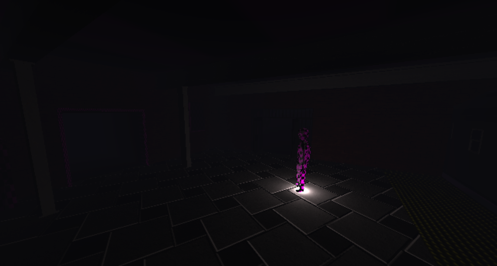

# Lemonade Rendering Engine (VULKAN, C++)

## Disclaimer

This project is currently in early development and rapidly changing. It is not recommended for use in prodution environments.
- API Changes are expected
- Uncertainty is guaranteed

## License

Copyright © Allan Moore 2026. All rights reserved.

You are granted permission to use this software for personal, educational, and non-commercial purposes only.
Commercial use, redistribution, and sublicensing are not permitted without a separate commercial license.

THE SOFTWARE IS PROVIDED “AS IS”, WITHOUT WARRANTY OF ANY KIND, EXPRESS OR IMPLIED, INCLUDING BUT NOT LIMITED TO THE WARRANTIES OF MERCHANTABILITY, FITNESS FOR A PARTICULAR PURPOSE AND NONINFRINGEMENT. IN NO EVENT SHALL THE AUTHORS OR COPYRIGHT HOLDERS BE LIABLE FOR ANY CLAIM, DAMAGES OR OTHER LIABILITY, WHETHER IN AN ACTION OF CONTRACT, TORT OR OTHERWISE, ARISING FROM, OUT OF OR IN CONNECTION WITH THE SOFTWARE OR THE USE OR OTHER DEALINGS IN THE SOFTWARE.



## Motivation

For quite a few years now I've beeen wanting to pick up Vulkan after spending many years working with OpenGL and after being made redundant at my last role as a programmer I decided now was the time. Although I had planned to build a set of libraries and release them to the general public my aspirations have changed a bit with my focus turning to devloping my own game whilst I continue to work on the rendering engine. I am separate to this project developing a new game engine "Strawberry" the game and the engine are currently very closesly coupled with no immediately release in mind for either. 

## A Rendering Engine NOT a Game Engine
The rendering engine is designed as a high level general purpose rendering engine and by that I mean it renders stuff but as far as lifecyle, entity, object, component management etc... you have to bring your own. The negatives generally being it actually makes the engine a little bit more abstract and more technical, but it does at least decouple the graphics logic from everything else. In it's current form a considerable amount of work is required to get up and running so to speak. The quick start guide tries to show the bare minimal setup though this is very much subject to change at the time of writing.

## (Not so)Quick (and very brief) Start Guide

Vulkan initialisation is largely handled by the Graphics Services singleton 

```
    void Init()
    {
        GraphicsServices::GetInstance().Init();

        Lemonade::GraphicsServices::GetRenderer()->OnPrepareScene.AddListener([this](const Lemonade::LRenderingData& data){
            // Prep scene, define environement & lighting data used by render pass.
            YourEngineSceneGraph->BeginRender();
        });

        Lemonade::GraphicsServices::GetRenderer()->OnRenderScene.AddListener([this](const Lemonade::LRenderingData& data){
            // Render geometry
            YourEngineSceneGraph->Render();
        });
    }

    void Update(){
        GraphicsServices::GetInstance().Update();
        GraphicsServices::GetInstance().Render();
    }

    void Unload(){
        GraphicsServices::GetInstance().Unload();
    }

```

Deeper look at the Render engine initilisation. 
Without getting into too much detail, the Graphics Services provide graphics context, time, rendering, window management and resource utilities.

The LGraphicsContext specifically defines our LVulkanDevice and VKInstance, creation of the VKInstance is handled by the LGraphicsContext::Init method, this is where at present where application data and vulkan extensions are specified there is currently no dynamic way of specifying extensions or application data.

The LVulkanDevice is a lemonade class that wraps much of the initial setup of of Vulkan, including picking the most suitable physical device on the system and setting up graphics, transfer, compute and presentation queues etc.. along with command pools and such.


```
	class LEMONADE_API LGraphicsContext : public AGraphicsContext
	{
	public:
		const LVulkanDevice& GetVulkanDevice() const noexcept { return m_vulkanDevice; }
		const VkInstance& GetVkInstance() const { return m_vkInstance; }

		// Hack called prior to swap chain creation, we can probably mitigate this by creating a surface just to query properties?
		void InitVulkanDevice() { m_vulkanDevice.Init(); }
	protected:
		virtual void Unload();
		virtual bool Init();
		virtual void Update(){}
		virtual void Render(){}
	private: 
		LVulkanDevice m_vulkanDevice;
		VkInstance m_vkInstance = nullptr;
	};

```


```
    // Snippet from Strawberry2D, might resembly more closely what you're engine loop might look like. LemonadeRE wraps the Graphics services initialisation shown in snippet above.
	void Strawberry2D::Start()
	{
		Init();
		EngineMain();
	}

	void Strawberry2D::Init()
	{
		m_renderEngine.Init();
		Services::GetInstance().Init();

		Lemonade::GraphicsServices::GetRenderer()->OnPrepareScene.AddListener([this](const Lemonade::LRenderingData& data){
			BeginRender();
		});

		Lemonade::GraphicsServices::GetRenderer()->OnRenderScene.AddListener([this](const Lemonade::LRenderingData& data){
			Render();
		});

        m_bRunning = true;
    }

    void Strawberry2D::EngineMain()
	{
		while (m_bRunning == true)
		{
			Update();
		}
	}

	void Strawberry2D::Update()
	{
		Services::GetInstance().Update();
		m_renderEngine.Update();
	}

	void Strawberry2D::Render()
	{
		Services::GetInstance().Render();
	}

	void Strawberry2D::BeginRender()
	{
		Services::GetInstance().BeginRender();
	}

```

```
    //Defined In the header 
    Lemonade::LemonadeRE m_renderEngine;
```


Before rendering things you'll want to populate the environment data i.e. Lighting data in the begin render
```
    void Scene::BeginRender() 
    {
        m_environmentData.DumpLightData();
        
        if (m_renderInput.LightBuffer  == nullptr)
        {
            m_renderInput.LightBuffer = std::make_shared<Lemonade::LUniformBuffer>(Lemonade::LBufferType::Storage, (void*)m_environmentData.GetLightPtr(), sizeof(Lemonade::LightingData) * m_environmentData.GetLightCount());
            m_renderInput.LightBuffer->SetShaderStage(VK_SHADER_STAGE_FRAGMENT_BIT);
        }

        m_renderInput.LightData ={
            .LightPtr = m_environmentData.GetLightPtr(), 
            .Count = m_environmentData.GetLightCount()
        };


        m_renderInput.LightBuffer->UpdateBuffer((void*)m_environmentData.GetLightPtr(), sizeof(Lemonade::LightingData) * m_environmentData.GetLightCount());

        Lemonade::GraphicsServices::GetRenderer()->SetRenderInput(&m_renderInput);
    }

    // Render Objects in scene
    void Scene::Render()
    {
        for (auto& entity : m_entities)
        {
            entity->Render();
        }
    }
```

A Render Component, the engine provides useful constructs for handelling and rendering mesh data.

```
namespace Lemonade
{
    LCube::LCube(CitrusCore::ResourcePtr<Material> material, glm::vec3 dimensions)
    {
        m_dimensions = dimensions;
        SetMaterial(material);
    }

    bool LCube::Init()
    {
        const std::shared_ptr<std::vector<glm::vec3>> CubeVertices = std::make_shared<std::vector<glm::vec3>>(std::vector<glm::vec3>
        {
            //...
        });
    
        const std::shared_ptr<std::vector<glm::vec3>> CubeNormals = std::make_shared<std::vector<glm::vec3>>(std::vector<glm::vec3>
        {
            //...
        });
    
        const std::shared_ptr<std::vector<glm::vec2>> UVS = std::make_shared<std::vector<glm::vec2>>(std::vector<glm::vec2>
        {
            { 0.0f, 0.0f,},
            { 0.0f, 1.0f,},
            { 1.0f, 1.0f,},
            { 1.0f, 0.0f,},
        });

        LMeshRenderer::Init();
        std::shared_ptr<Mesh> mesh = std::make_shared<Mesh>();

        std::shared_ptr<std::vector<glm::vec3>> vertices = std::make_shared<std::vector<glm::vec3>>();

        for (const auto& vertex : *CubeVertices)
        {
            vertices->push_back(vertex * m_dimensions);
        }

        mesh->SetVertices(vertices);
        mesh->SetShouldGenerateTangents(false);
        mesh->SetNormals(CubeNormals);

        SetMesh(mesh);

        std::shared_ptr<std::vector<glm::vec2>> coords = std::make_shared<std::vector<glm::vec2>>();

        for (int i = 0; i < 6; i++)
        {
            coords->push_back(UVS->at(0));
            coords->push_back(UVS->at(1));
            coords->push_back(UVS->at(2));
            coords->push_back(UVS->at(0));
            coords->push_back(UVS->at(2));
            coords->push_back(UVS->at(3));
        }
        mesh->SetUVS(coords);
        return true;
    }
}
```

Render stage/ pass system. 
The engine has a high level system for specifying multiple render passes an example of the geometry pass is shown below, currently included within the render engine source code. Shaders not included.
Using the built in LRenderTarget class you're able to specify such things as: 
- number of colour attachments/ render targets
- number of layers texture array or array of textures
- Custom texture bindings & uniform/ storage buffers 
- Depth attachment, depth attachment binding, multiple layered depth attachments (useful for shadow mapping)

```
// Example render stage geometry pass.
namespace Lemonade {

    bool GeometryStage::Init() 
    {
        std::shared_ptr<ShadowPass> shadowPass = std::make_shared<ShadowPass>();
        std::shared_ptr<GeometryPass> geometryPass = std::make_shared<GeometryPass>();

        geometryPass->SetShadowPass(shadowPass);

        AddPass(shadowPass);
        AddPass(geometryPass);
        return true;
    }
}
```

```
namespace Lemonade
{
    GeometryPass::GeometryPass() : 
        m_deferredPass(GraphicsServices::GetGraphicsResources()->GetMaterialHandle("Assets/Materials/deferred.mat.json"))
    {

    }

    bool GeometryPass::Init() 
    {
        m_deferredPass.Init();
        m_geometryTarget.Init();
        m_gBuffer.Init();
        m_gBuffer.SetColourAttachments(1, false);
		m_geometryTarget.SetColourAttachments(4, false);
        m_geometryTarget.AddDepthAttachment();
        m_deferredBuffer = std::make_shared<LUniformBuffer>(LBufferType::Uniform, &m_deferredData, sizeof(DeferredData));
        m_deferredBuffer->SetShaderStage(VK_SHADER_STAGE_FRAGMENT_BIT);
        m_deferredPass.GetRenderBlock()->AddUniformBuffer(m_deferredBuffer);
        // Explicily specify Shadow map binding.
        m_deferredPass.GetRenderBlock()->AddBinding(std::make_shared<LBinding>(m_shadowsImageSamplerLocation, 
                                                                                VkDescriptorType::VK_DESCRIPTOR_TYPE_COMBINED_IMAGE_SAMPLER, 
                                                                                VK_SHADER_STAGE_FRAGMENT_BIT, 
                                                                                m_shadowPass->GetMaxShadowMaps()));

        m_deferredPass.GetRenderBlock()->OnPipelineBound.AddListener([this](ARenderBlock* renderblock){
            m_shadowPass->GetShadowRenderTarget().SetRenderBlock(renderblock);
            m_shadowPass->GetShadowRenderTarget().BindDepthAttachment(m_shadowsImageSamplerLocation);
        });
        return true;
    }

    void GeometryPass::UpdateDeferredData(const LRenderingData& renderingData)
    {
        // Lighting data per scene, not updated until after scene is rendered... 
        if (m_lightignBuffer == nullptr)
        {
            m_lightignBuffer = renderingData.RenderInput->LightBuffer;
            m_deferredPass.GetRenderBlock()->AddUniformBuffer(m_lightignBuffer);
        }

        if (m_deferredData.LightCount != renderingData.RenderInput->LightData.Count)
        {
            m_deferredData.LightCount = renderingData.RenderInput->LightData.Count;
            m_deferredBuffer->SetDirty();
        }
    }

    void GeometryPass::Render(const LRenderingData& renderingData)
    {
        m_geometryTarget.BeginRenderPass();
        m_geometryTarget.setClearColour(glm::vec4(0,0,0, 0));
        m_geometryTarget.Clear((uint)LBufferBit::COLOUR);
        GraphicsServices::GetRenderer()->PrepareScene();
        GraphicsServices::GetRenderer()->RenderScene();
        m_geometryTarget.EndRenderPass();

        /// Should be called after rendering scene.
        UpdateDeferredData(renderingData);
        
        m_gBuffer.BeginRenderPass();
        m_gBuffer.setClearColour(glm::vec4(0,0,0, 0));
        m_gBuffer.Clear((uint)LBufferBit::COLOUR);
        m_deferredPass.SetRenderTarget(&m_geometryTarget);
        m_deferredPass.Render();
        m_gBuffer.EndRenderPass();
    }

    void GeometryPass::Update() 
    {
        m_deferredPass.Update();
    }
}
```
